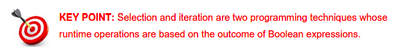

# Introduction 📚

Thus far, we have been dealing with sequential programs i.e. programs which begin their execution at the first line and execute each line in order until the last line is reached. 
In addition to sequence, Python supports two other control structures known as selectionand iteration. 

The purpose of this section is to explain the syntax and semantics of selection and iteration, and explore some common programming techniques used to apply them in real-world contexts.

## Selection

Selection structures are commonly referred to as decisions. These structures provide programmers with a branching mechanism whereby, certain blocks of code may be either executed or skipped at runtime. The decision of which block of code to select for execution depends on the result of a condition also known as a Boolean expression.

The main Python keywords used to support decision structures are ``if, else`` and ``elif``.

## Iteration

Iteration structures are commonly referred to as loops. Loops are used to cause the same block of code to be executed multiple times. At runtime, the code inside a loop (the loop body) is executed repeatedly as long as some condition (the loop guard) is met. The loop guard is also a *Boolean expression*. 

The main Python keywords used to support iteration structures are ``for`` and ``while``.

Three other *(less important)* keywords that relate to loops are ``break``, ``continue`` and ``pass``.

