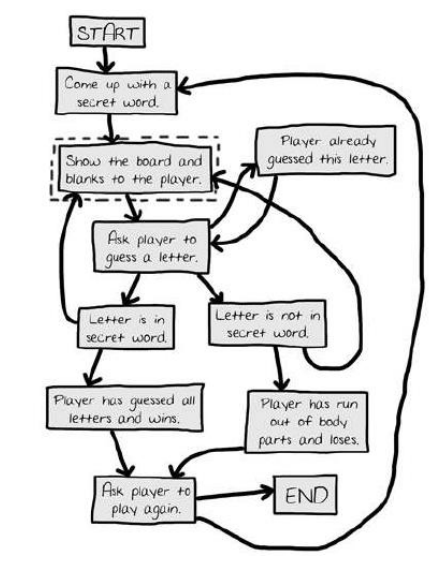
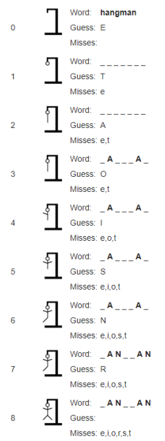

# Boolean Expressions 📚

A Boolean expression is any expression that evaluates to either ``True`` or ``False``. 

Boolean expressions form the basis of all programming logic.

Boolean Logic was invented by the mathematician George Boole, 1815-1864 who was the first professor of Mathematics at University College Cork (UCC). 

Unfortunately, at the time, there seemed to be no use for 
this kind of mathematics. 

This changed when computers started to be used to analyse 
data and to make logical decisions, i.e. to ask a question and 
depending on the answer, perform specific tasks. 

It then turned out that *Boolean logic* was exactly what was needed! 😎

The algebra on which Boolean logic is based is used extensively to build electronic circuits and write computer programs. Boolean logic, therefore, forms the basis of all modern digital devices and software systems.

Boolean expressions are to Boolean algebra, what algebraic expressions are to algebra, and arithmetic expressions are to arithmetic. At any given moment in time, a Boolean expression 
will evaluate to either ``True`` or ``False``. It can never be anything in between.

## Hangman ✍
Hangman is a well-known guessing game usually played by two people using pencil and paper. One player thinks of a word and the other tries to guess it by suggesting letters within 
a certain number of guesses.

The illustration below depicts the main steps *(flow chart)* of the game.

The graphic below illustrates a sample run of the game, where the player is trying to guess the word hangman.

## Task
👉 Study the illustrations above carefully and identify the areas where *sequence, selection and iteration* could be used in a programming solution for the game.

