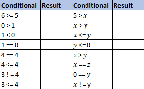

# Making Comparisons 📚

## Comparative Operators
Sometimes we need the computer to compare one item with another and record the result. Comparative operators are used for this. 

The symbols used by Python for these operators are shown in the table below.


👉Notice that the symbol used for the *“Is equal to”* operator 
consists of two equals signs `==` instead of one. Why do you 
think this is?

## Simple Boolean Expressions

A simple Boolean expression is one that uses a single relational operator (e.g. greater than, less than or equal to etc.) to compare (i.e. relate) two values. 

For example, ``7 > 3`` (seven greater than three) is a simple Boolean expression that compares the numbers 7 and 3 under the relation of ‘greater than’. It evaluates to ``True`` because 7 is a bigger number than 3. 

On the other hand, the expression ``7 < 3`` evaluates to ``False``, because 7 is not less than 3.

Simple Boolean expressions (as created by the basic relational operators) are the basic 
building blocks used to implement decisions and loops in Python. 

Python supports the six relational operators given below.


## Task 1 - Predict
Some more examples of simple Boolean expressions (aka conditions) are presented below.

👉 Using either ``True`` or ``False`` evaluate each of the following conditions.


Note: ``x = 1, y = 0`` and ``z = −1.``



<details>
  <summary> 👀 Solution - Don't click this until you've tried it yourself.</summary>
  I can't believe you cheated!

  
  
  </details>


## Task 2 - Investigate
👉 In `main.py` code up the table above and see if your predictions match the console output.

Here is some code to get you started...

````py
# initialise variables x, y and z
x = 1
y = 0
z = -1

print(6 >= 5)

````


