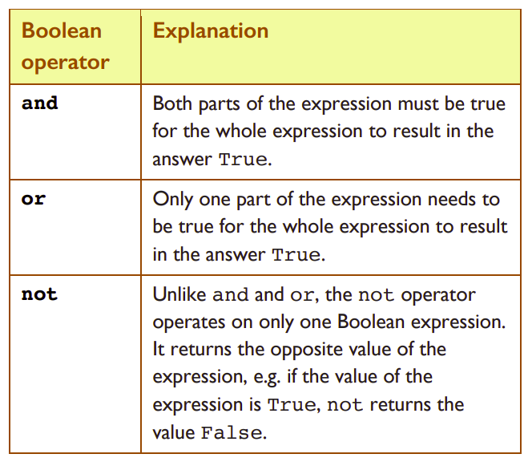

# Compound Boolean Expressions 📚

Compound Boolean expressions are formed by connecting simple Boolean expressions together using any of the three Python Boolean operators: ``and``, ``or``, and ``not``.

Just like simple Boolean expressions, compound Boolean expressions always evaluate to either ``True`` or ``False``. 
The combinations of values for inputs and their corresponding outputs for ``and``, ``or``, and ``not``can be conveniently represented in a tabular format known as a *"truth table"*.



## Truth Tables

``not`` is the simplest of the three Python Boolean operators. It is a unary operator meaning that *it can only work on one operand at a time*. The truth table showing the relationship 
between some proposition ``A`` and ``not A`` is shown below.


Both ``and``, and ``or`` are binary operators meaning that they require two operands to work. The truth tables for ``and``, and ``or`` are shown below.


The (binary) inputs are given by the columns A and B and the output for these inputs is shown in the rightmost column.

## Task 1 - Predict

👉 For the purpose of the examples shown below we will assume that we have a number of variables assigned as follows: 

``x = 1, y = 0, z = −1`` and ``valid = True``, ``finished = False``.

✍ Write down the results to the following conditions in your copy.


<details>
  <summary> 👀Solution: </summary>

  You cheated again didn't you!

  
  
</details>

## Task 2 - Investigate
👉 In `main.py` code up the table above and see if your predictions match the console output.

Here is some code to get you started...

````py
# initialise variables x, y and z
x = 1
y = 0
z = -1

# initialise valid and finished
valid = True
finished = False

print(x == 1 and y == 0)

````

