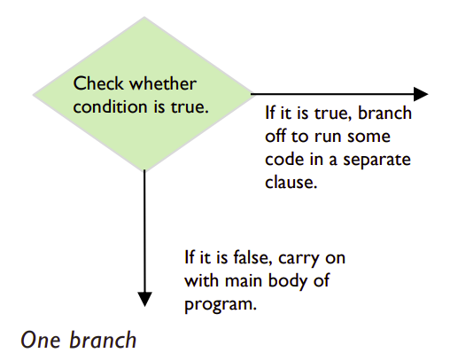

# Conditionals 📚

Computer programs often need to branch off in different directions depending on certain conditions. To use a condition in your code, you need a command called a *conditional*. 

Conditionals use Boolean expressions to test if something is 
``true`` or ``false``. 

Depending on the result of the test, a different branch, i.e. path, is taken through the program. For example, when you go to pay at the automatic checkout in the supermarket, you will be given a choice of cash or card. The computer responds differently depending on which payment method you select.
Branches are executed if, and only if, the overall Boolean 
expression evaluates to True.

Now we're ready to tackle some *"if statements"* and build upon the logic we learned using Boolean expressions.

## if statements

The simplest type of conditional is an ``if`` statement. This 
statement has only a single branch.

Note: *If the condition is true, then the computer executes the code in the branch following the if statement. This piece of code is also known as a clause. If the condition is not true, the clause is skipped and the next statement in the main body of 
the code is executed.*

## Challenge

👉 Watch the video attached *"Day 5 - 100 Days of Code"* and see if you can code along with David in `Thonny`.

[Day 5 - 100 Days of Code](https://www.youtube.com/watch?v=Wmn9yze6m5U)

We will be looking more at *if statements* in our next tutorial. 

