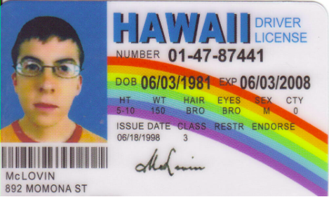

# Driving License Application 

## Task 👨‍💻
👉 Create a program that asks a user for their age.
If they are 18 or older, they can apply for their full license.

👉If they are between 16 - 18 years old they can apply for their provisional license.

👉If they are younger than 16 years old they are not eligible to apply for their license. 

👉 Begin by drawing a flow chart to show the branching involved in the program, using the `.draw` file.