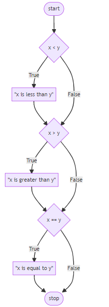

# More about *if statements*

## (CS50P - Lecture 1 - Conditionals)

We're going to be writing code to compare two numbers.


## Challenge 1 👨‍💻
Prompt the user to enter 2 numbers `x` and `y` and then compare them using the comparison operators, to see if `x`
is less than `(<)`, greater than `(>)` or equal `(=)` to `y`. 

The flow chart below shows how we could do this by asking 3 separate questions.



<details>
  <summary> Hint 👀 </summary>

  ````py
# Challenge 1

x = int(input("What's x? "))
y = int()

if x < y:
  print("x is less than y")
if x > y:

if x = y

  ````
</details>

## Challenge 2 👨‍💻

This program can be improved by *not* asking three consecutive questions. After all, not all three questions can have an outcome of true! 

The flow chart below shows how we can rearrange the search:


Revise your program and improve it.

<details>
  <summary> Hint 👀 </summary>

  ````py
  # Challenge 2

x = 
y = 

if x < y:
  print("x is less than y")
elif x > y:

  ````
</details>


# Challenge 3 👨‍💻
There is one final improvement we can make to our program. 

Notice how logically `elif x == y:` is not a necessary evaluation to run. 

After all, if `x` is not less than `y`, AND `x` is not greater than `y`, `x` MUST equal `y`. 

Therefore, we don’t have to run `elif x == y:`. We can create a *“catch-all”* default outcome using an ``else`` statement.

👉 Using the `.draw` file attached, I want you to draw a flow chart of your simplified solution to Challenge 3.

👉 Revise your code from above and make the necessary changes to simplify the logic.

<details>
  <summary> Hint👀  </summary>

  ````py
# Challenge 3

x = 
y = 

if 
elif  
else
   
  ````
</details>


# Extra Credit ✨
Suppose we just wanted to check if our 2 numbers are equal to each other or not.

Can you use another Python *keyword* or *operator* to help simplify your if statement & improve it's efficiency.

<details>
  <summary> Hint 👀 </summary>

  ````py
  or

  != 

  == 
  
  ````
</details>

> 

