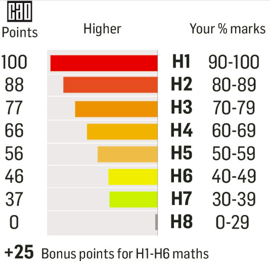

# Leaving Cert Grade Calculator

Create a program that calculates a student's Leaving Cert Higher Level grade. The grade is based on the percentage they enter, which must be entered by the user, as a whole percentage value. 

The grades H1 - H8 are allocated as shown above.

👉 Your program should promt the user to enter their mark as a whole percentage number *(i.e. 65%, 80%, 92%).*

👉 Your program should also display the number of points awarded for each grade *(i.e. H6 = 46 points, H5 = 56 points).*

👉 Use the `.draw` file to show the branching involved in creating your program.

 👀Hint

Use `elif` to help with your conditions.
  

> 

## Extra Credit ✨

👉 Can you edit your code to include the bonus points awarded for Higher Level Maths.

  