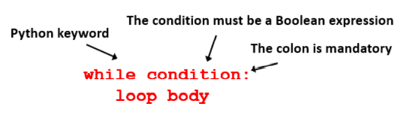
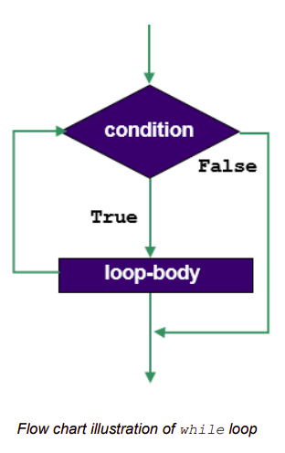
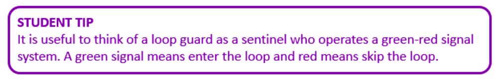

# While Loops & Iteration 

Iteration is a programming technique that allows programs to execute statements multiple 
times. Python provides built in supports for two different kinds of iteration statements:
- the ``while`` loop
- the ``for`` loop

## The ``while`` loop
This is Python’s most general (and therefore) flexible loop construct.
The syntax and semantics of Python’s ``while`` loop are illustrated and described below.

 

In Python, while loops are introduced with the keyword ``while``.

This is followed by some condition which has to be made up by the programmer *(this is the ‘hard’ part!)*. 

If the result of the condition is ``True``, the statement(s) that make up the loop body are executed. These statements must be indented. 

When Python reaches the last line of the loop body the flow of control loops back to the condition which is evaluated again. *(Python will know the last line of the loop body from the levels of indentation.)* The above process continues until the result of the condition is found to be ``False``.

 

When (and if) the condition is ``False``, Python skips the loop body, and the flow of control resumes at the next statement following the loop body.

### 💡 Note:

It is the programmer’s responsibility to ensure that the loop body 
contains a line of code that will cause the loop condition to eventually become False. 

Otherwise, the loop will never terminate. Such loops are called *infinite loops*.

It is also worth noting out that the loop body might not ever be executed. This situation would arise when the condition evaluates to ``False`` before the first iteration. If this happens the loop body is skipped and the flow of control continues from the first statement after the loop body.

Because the condition *‘guards’* entry into the loop, it is referred to as the loop guard.

 

