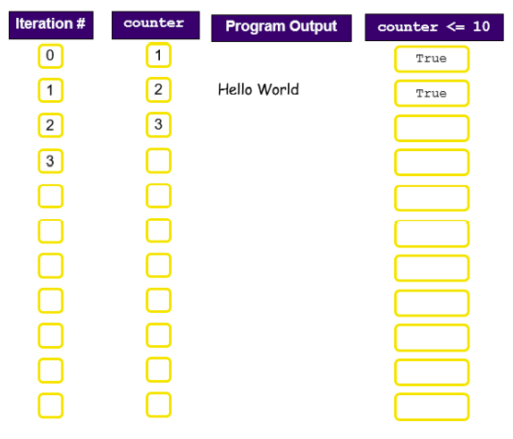

# Challenge 1 - While Loop

This short challenge shows the main features of a ``while`` loop.

👉 Create a program that displays the message *"Hello World"* ten times.

👉 The string "Goodbye" is displayed once before the program exits.

<details>
  <summary> Sample Code </summary>
  
  ````py
# Simple while loop

# What is happening here?
counter = 1

# Loop 10 times
while counter <= 10:
    print("Hello World")  # What is happening here?
    counter = counter + 1 # What is happening here?

# This line is only executed once
print("Goodbye")
  ````
</details>

## 💡 Understanding the code 🕵️‍♂️
- The loop is introduced by the ``while`` keyword on line 7. Note the use of colon ``:`` at the end of this line.
- The condition counter ``<= 10`` is central to how the loop operates. The loop will be executed as long as this condition remains ``True``.

The condition is initially ``True`` because the variable counter was initialised to 1 on line 4.
- Lines 8 and 9 make up the loop body.
  - line 8 tells Python to display the string, "Hello World"
  - line 9 tells Python to increase the value of ``counter`` by 1 *(recall running totals)*
- The next line to be executed after line 9 is always line 7. *(This is the iteration).*
- Each time line 7 is executed the value of ``counter`` will have increased by one since the previous iteration. Eventually, ``counter`` will have reached a value of 11 and the condition will be found to be ``False``.

- At this point the flow of control jumps beyond the loop body and line 12 is the next, and final, line of the program to be executed.


## 💡 Understanding Iteration (loop counter) 🕵️‍♂️
- It is well worth investing some time in this example to make sure you understand exactly how while loops are executed at runtime.

- If we define an iteration to be the number of times a loop body has been executed, we can use the technique of tracing to keep track of the loop’s progress.

- Initially, (before any iterations), counter is set to 1, there is no program output displayed, and the condition ``counter <= 10`` is ``True``. After one iteration of the loop, counter has a value of 2, the string "Hello World" is displayed and the condition remains ``True``.

Continue in this way until you complete the ‘trace diagram’ shown below:



✍ Complete the trace diagram above in your copy to ensure you understand how the loop counter works. 


