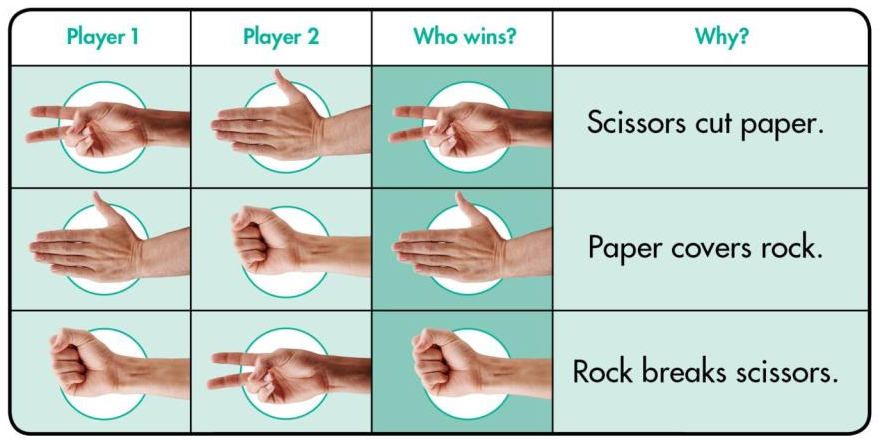

# Rock - Paper - Scissors


Today, we'll learn how to create a simple Rock Paper Scissors game in Python. 

This game will allow the user to play against the computer using basic programming concepts like ``if / elif / else`` statements and a simple `while loop`.

## Objectives 📝
By the end of this lesson you will: 
- Understand basic Python syntax and programming concepts.
- Learn to use ``if/elif/else`` statements for comparison & decision-making.
- Implement a simple ``while loop`` to allow repeated gameplay.
- Gain experience in user input and ``random`` number generation.

## Task 1 - Group Strategy⚔️
- Using a pen and paper, work together with a classmate to plan how you might tackle this problem.
- Make a list of _keywords_ you might use & _variable_ names.
- Use _"PSEUDOCODE"_ to plan your program solution.


## Task 2 - Challenge ⚔️
Now we are going to try to program our solution.

In the next few paragraphs you will find some sample code that you can use to help with your solution.
If you wish to jump right in and start coding you can, but your console output **_must_** look like the examples shown below:

### Initial Screen 👨🏽‍💻
````
************************
Rock - Paper - Scissors
************************

Enter your choice - Rock, Paper, or Scissors: 

````

### After Game Played 👨🏽‍💻
````
************************
Rock - Paper - Scissors
************************

Enter your choice - Rock, Paper, or Scissors: Rock
You chose -> Scissors
Computer chose -> Paper

You Win!
Would you like to play again? (yes/no):
````

👉🏽 Go ahead and see what you can create...work together to build a solution! 


## Task 2 - Sample Code 👨🏽‍💻
Let's think about what we want to happen...
- Prompt the User to enter either Rock - Paper - Scissors.
- Compare this to what the computer randomly picks.
- Using the rules of rock-paper-scissors, determine the winner.
- Ask the User if they want to play again.  

1. Import the random library Module
```py
# Call and use the random library from Python
import random
````


2. Create a welcome screen & get User input.
````py
print("**")
print("Rock - Paper - ")
print("**\n")

# Prompt user to enter their choice
user_choice = input("")
user_choice = user_choice.lower()  # what does this line do?
````

3. Create a list called `options = []`, this is a new programming concept.
   - Lists are used to store multiple items in a single variable.
````py
# Create a List of possible options.
options = ["rock",]
````
### 💡Note:
> Use this link -> [Python Lists](https://www.w3schools.com/python/python_lists.asp) to learn more about `lists[]`


4. Now get the computer to randomly select one of the options from the list.

````py
#The choice() method returns a randomly selected element from the options list.
computer_choice = random.choice(options)
````
### 💡Note:
> Use this link -> [Python Random Library](https://www.w3schools.com/python/ref_random_choice.asp) to learn more about `random.choice()`


5. Let's send a message to the console showing the User's choice and Computer's choice.

````py
# Let's try to use f-strings to print our mesages to the console  
print(f"You chose -> {user_choice.capitalize()}")
print(f"Computer chose ->")
````

### 🤔Question to make you think...
> What does `.capitalize()` do?


6. Now we need to compare the User's choice against the Computer's, to see who wins.
````py
# We will need to use comparison operators if, elif and else.
# Compare user_choice against computer_choice

if user_choice == computer_choice:
  print("")
elif :


  print("\nYou Win!")
else:
  print("\nYou Lose.")
````

### 💡Note:
Again the code above is not complete, think through the _LOGIC_ needed to make the comparison. 

<details>
<summary>👀 Hint</summary>

Remember we looked at Boolean Operators before `and`, `or`.

These can be used within our `elif` statements.

````py
(user_choice == "rock" and computer_choice == "scissors") 
````
  
</details>


8. Ask the User if they would like to play again.
````py
# Ask user if they would like to play again. 
play_again = input("")
# Convert their answer to lowercase letters.
play_again = 
````

9. Now we need to _WRAP_ all of our code in a `while` loop, so the User is asked repeatedly if they want to play again.
    - Work together with your classmates to see if you can solve this problem.
    - Don't forget about _indentation_!

<details>
<summary>👀 Hint</summary>

````py
while True:
````
</details>

  
10. Finally we need to check if the User wishes to play again, if they select _"No"_ then `break` out of the loop and display a goodby message.
<details>
<summary>👀 Hint</summary>

````py
# Can you remember what this Boolean Operator does " != " ?
# Break out of our while loop if the user no longer wishes to play the game.
if play_again != "yes":
````
</details>


