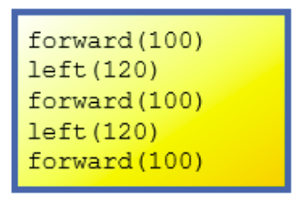
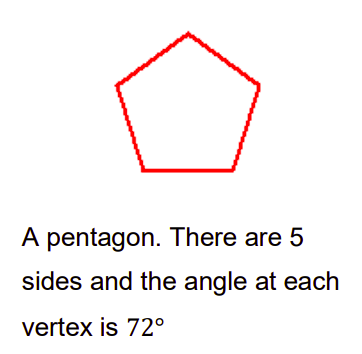
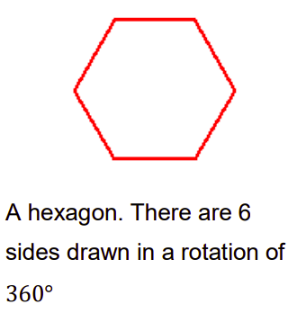
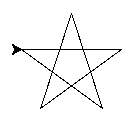

# 🐢Turtle Graphics & For Loops

We are going to return to Turtle Graphics again to look at how we can draw geometrical shapes & use *"For Loops"* to optimise our code.

💡 *Note: we must import the turtle library at the beginning of our program.*


  ## Task 1
  
- Predict what shape the following code will produce.

 

✍ Write your prediction in your copy before coding up the solution.


## Task 2
- Using a `for` loop, can you draw the same shape as Task 1 above.

💡 *Hint:*

````py
for i in range()
````

## Task 3
- Using a `for` loop, can you draw a square.

## Task 4
- Using a `for` loop, can you draw a pentagon.

 

## Task 5
- Using a `for` loop, can you draw a hexagon.




## Task 6
- Using a `for` loop, can you draw an octagon.

## Task 7 
- Prompt the user to enter the number of sides they wish their shape to have.
- Then using what you have learned so far, create a program that will draw that shape.

## Task 8
- Draw a five-pointed star.
 


# ✨Nested Loops
We can use *"Nested Loops"* to draw beautiful and complex looking patterns.

Type the following code into `main.py` and see what shape it creates.

````py

for i in range(0,10):
  turtle.right(36)
  for i in range(0,5):
    turtle.forward(100)
    turtle.right(72)

turtle.exitonclick()

````

👉 Experiment with the code segment above and see what other patterens you can design. 

## Links & Further Reading 📚

Click on this w3schools link for more examples of [For Loops](https://www.w3schools.com/python/python_for_loops.asp) and what they can be used for. 

  