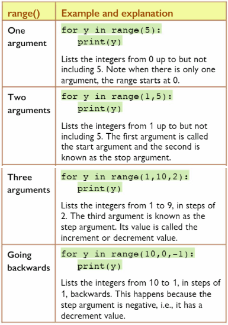

# 📚 For Loops - Recap

### Remember a `for` statement always consists of: 
- The word `for`.
- A loop control variable or counter.
- The word `in`.
- A way of setting the number of times the loop must repeat *e.g. by using* `range()`.
- A colon `:`.
- Starting on the next line, an indented block of code called the `for` clause.


## Basic `for` loop

Use the code below to print out numbers in a list.

````py
for i in range(1,5):
  print(i)
````
💡 Notice how the last number printed is 4 and not 5. This is because the second number in `range()` tells the computer to count up to, *(but not including)*, that number. 

- Experiment using different values inside the `range()` brackets to get different results.
*e.g.* `range(3), range(7)`. What do you notice?


## Range Function - arguements
We have already used the `range()` function with one, two or three arguements in earlier problems.

Here's a quick reminder of what they do:

 

👉 Experiment with the examples above to make sure you understand how these arguements work.


## Task 1

✍ Predict what the output of this loop will look like.

````py
for y in range (10, 0, 1):
  print(y)
````
Type the code into `main.py` to check your prediction.

### Remember whe using `range()`that:
- All arguments must be integers
- Arguments can be positive or negative
- When there is only 1 argument, *i.e.* `range(y)`, the list starts at `0` and lists values up to but not including `y`.
- When counting up or down in steps, you must include a thrid argument to specifiy the increment or decrement.
